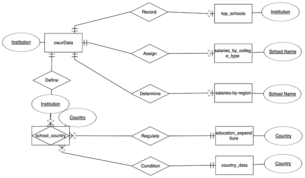
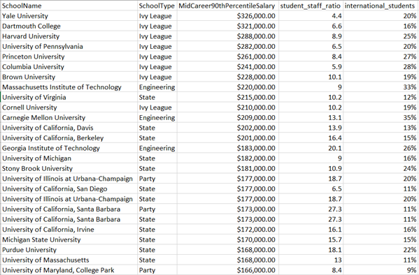

# College Review Website

### Project Overview
Our data analytics team is consulting for Niche.com.  While Niche is a reputable resource in the American market, the website is limited to the US market. Our firm has been brought in to expand upon their current data set by introducing more distinguishing fields as well as to establish data on universities from abroad in order to grow their user base internationally. 

### Data Used

- [World University Rankings](https://www.kaggle.com/mylesoneill/world-university-rankings?select=cwurData.csv)

- [Salaries by College Type](https://www.kaggle.com/wsj/college-salaries?select=salaries-by-college-type.csv)


- [Recent College Grads Can Expect to Make the Highest Salaries in Germany and US](https://www.kornferry.com/about-us/press/Recent-College-Grads-Can-Expect-to-Make-the-Highest-Salaries-in-Germany-and-U.S)

- [Cost of Living](https://www.expatistan.com/cost-of-living/country/ranking)


### Relational Diagram


### Question Asked and Sample Query

Is having a higher rate of international students and smaller student to staff ratio related to higher Mid-Career 90th Percentile Salary?

```sql SELECT s1.SchoolName, s1.SchoolType,
s1.MidCareer90thPercentileSalary, t1.student_staff_ratio,
T1.international_students
FROM salaries_by_college_type as s1
INNER JOIN timesData as t1
on s1.SchoolName = t1.university_name
WHERE s1.MidCareer90thPercentileSalary != 'N/A' 
and s1.SchoolName != 'University of Wisconsin'
GROUP BY s1.SchoolName, s1.SchoolType
ORDER BY s1.MidCareer90thPercentileSalary desc
```
### Output Result


### Description of Business Problem Addressed
Lower student to staff ratio leads to more personal relationships professors develop with students, which results into:
- More questions answered
- Assisting with finding higher paying jobs

Higher international student ratio leads to:
- More diverse learning experience
- Better professional expertise


